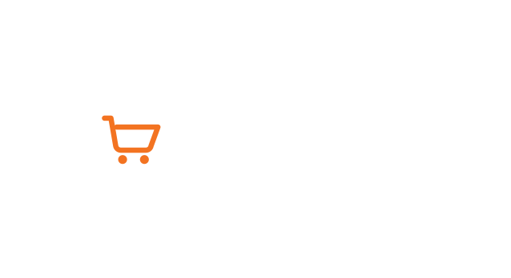

# OpenCart

✊ Образы для быстрого прототипирования актуальной версии [OpenCart][1] 4.x под соответствующую версию PHP.

## 🚀 Старт

Вы можете перейти в директорию [example-app](example-app), где подробно изложено как правильно и быстро запустить свой проект на OpenCart.

## 🧱 Образ

Образ состоит из следующих составляющих:

1. **Теги** — каждый тег образа представляет собой отдельную версию PHP. Тег всегда начинается с названия языка и его
   версии, например: `php-8.3` или `php-8.5`. Следующая обязательная часть названия `fpm`, что является указателем на использования
   процессного менеджера для высокопроизводительных приложений. Тег оканчивается названием (кодовым)
   системы, на которой разворачивается контейнер, например: `bookworm` (Debian 12) или `trixie` (Debian 13).
2. **Dockerfile** — в Dockerfile устанавливаются все необходимые пакеты и расширения для PHP. Предустановлены все
   пакеты, которые используются в большинстве приложений, включая `curl`, `gd`, `mbstring`, `mysqli` и `zip`.
3. **docker-entrypoint.sh** — скрипт выполняется при запуске контейнера. Он содержит логику по установке и настройке
   `OpenCart` для работы из коробки. В процессе выполнения скачивается и устанавливается актуальный релиз `OpenCart` 4.x (если еще не установлен) и настраиваются все инструменты для работы. Файлы корня репозитория (`docker-compose.yml`, `makefile`, `.env`, `README.md`) не перезаписываются: магазин кладётся в `public/`, а `config.php` создаёт установщик внутри корня сайта.

## 📄 Лицензия

Распространяется под лицензией MIT.

**Кратко о лицензии MIT:**

- ✅ Можно свободно использовать, копировать, изменять, распространять
- ✅ Можно использовать в коммерческих проектах
- ✅ Не нужно открывать исходный код производных работ
- 📋 Единственное условие — сохранить уведомление об авторских правах и лицензии

Полный текст лицензии доступен в файле [LICENSE](LICENSE)

Сам OpenCart распространяется под [GNU GPL v3](https://github.com/opencart/opencart/blob/master/LICENSE.md).

[1]: https://www.opencart.com
